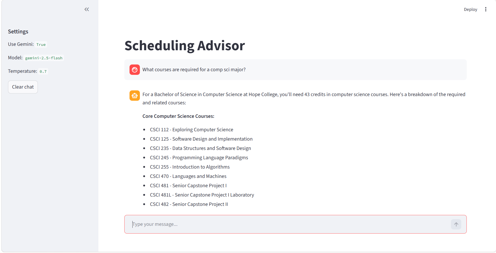
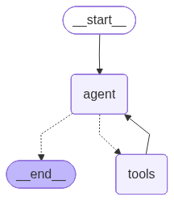
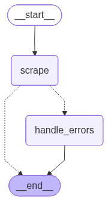

## What it does

This application is a scheduling advisor for college students. It is primarily geared towards freshmen who are considering possible majors and want to explore different course options. This application combines data from the university's course catalog, degree requirements, and an LLM to provide personalized scheduling advice.

## How it works

This application uses a LangGraph workflow to integrate various tools that interact with the university's course catalog and degree requirements. The LLM is used to process user input and generate personalized scheduling advice based on the information retrieved from the tools.

Workflow 1 is the primary workflow that loops between the agent and tools. Workflow 2 is a sub-workflow that the agent can call to scrape the university's website and handle errors.

LLM Available Tools: 

- search_docs: Searches the course catalog to find relevant course information.
- create_schedule: Generates a personalized schedule based on the user's preferences and the information retrieved from the course catalog.
- program_scraper: Scrapes the university's website to gather information about different majors and their requirements.
- major_url_lookup: Retrieves the catalog URL from different majors and their requirements.

## Example of the workflow in action

::: {.columns}

::: {.column}
#### Workflow 1

:::

::: {.column}
#### Workflow 2

:::

:::

## Team

- Alem Kemal (@alemkemal21)
- Eleanor Koh (@kohzhiy)
- Katie Mozak (@kat635)

## Acknowledgements

This project's structure was initially based on a project from the Creating with AI in the Loop course developed by Dr. Yurk. We have significantly modified and expanded the original concept and implementation.